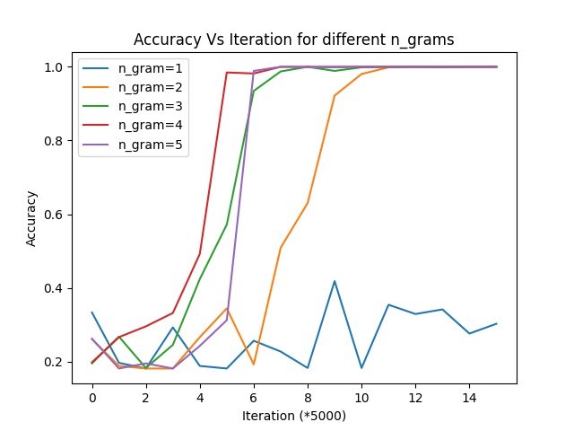
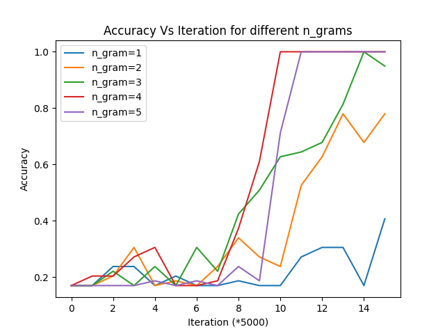
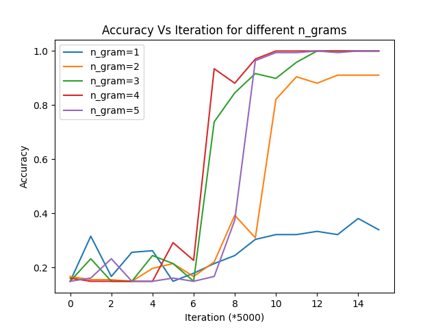

# Decrypting Cipher with Markov Chain Monte Carlo

## Abstract
*We examine the use of Markov Chain Monte Carlo (MCMC) algorithm to break subsitution ciphers. We use MCMC to sample keys from possible decryption keys. We employ n-gram frequency analysis to evaluate the quality of the sampled keys. We use simulated annealing to enhance the performance of algorithm. The accuracy of the algorithm is almost 100% for the cipher text with length of 500 or more characters. For shorter cipher text, the accuracy depends on the length of the n-gram used in the n-gram frequency analysis.*
## Introduction
Markov Chain Monte Carlo are popular methods of sampling from a complicated probability distributions. Its use in cryptography is not new. This approach was first introduced by Marc Coram and Phil Beinke, and later studied more systematically by Connor. In this project, we implement these techniques using Python. We first introduce subsitution ciphers, and then describe the MCMC algorithm. We then describe the n-gram frequency analysis, and finally we describe the simulated annealing algorithm. We then present the results of our experiments.

### Subsitution Ciphers
A subsitution cipher is a type of encryption algorithm that replaces each plaintext character with a different ciphertext character. The original text is called the plain text and the encrypted text is called cipher text. In substitution ciphers, the encryption key is a permutation of the alphabet. For example, we could replace A with B, B with C, C with D and so on. For this example, the shift would be 1. With this key, the world 'hello' becomes 'ifmmp'. Such substitution ciphers where characters are shifted by an integer are called Caeser ciphers. Instead of shifting, we could also randomly permute the alphabet. For example, we could replace A with C, B with D, C with E and so on. With this key, the world 'hello' becomes 'jgnnq'. Such substitution ciphers where characters are randomly permuted are called random ciphers.
#### Python Implementation
In the file *cipher.py*, we have implemented the substitution ciphers as a class. The substitution cipher takes a key of permutation of alphabets, like 'UNMLFPRITKQSDBOAYCZVWHJXEG'. The subsitution cipher is inherited by the Caeser cipher and the random cipher. Caeser cipher takes an integer as a key instead of the alphabets. Giving it a key of 1 would shift all the alphabets by 1, like A becomes B, B becomes C, Z becomes A and so on. The random cipher doesn't take any input. It will just randomly permute the alphabets and use it as a key. These all classes have two main methods: *encrypt* and *decrypt*. *encrypt* takes a string as input and returns the cipher text. *decrypt* takes a cipher text as input and returns the plain text. 
### Markov Chain Monte Carlo
Markov Chain Monte Carlo is an algorithm to sample from a complicated probability distribution. The state space in our project is the state of all possible decryption keys. It has $26!$ possible states. The transition probability is the probability of moving from one state to another. In our project, we use the transition probability of randomly swapping two characters in the key. The initial state is a random key. The goal is to sample from the distribution of the keys that decrypt the cipher text. We use the n-gram frequency analysis to evaluate the quality of the sampled keys. The n-gram frequency analysis is described in the next section. We use simulated annealing to enhance the performance of algorithm. The simulated annealing is described in the next section as well.
### n-gram Frequency Analysis
We read a large text in English to do the frequency analysis. Such a text is called reference text. We use *War and Peace* as our reference text. We then count the frequency of each n-gram in the reference text. For example, if we use n=2, we would count the frequency of each pair of characters. We then use the frequency of each n-gram in the reference text to evaluate the quality of the sampled keys. We use the log-likelihood of the n-gram frequency in the reference text and the n-gram frequency in the cipher text. The likelihood is defined as:
$$\pi(x)=\Pi_{\beta_1 \beta_2} r(\beta_1,\beta_2)^{f_x(\beta_1,\beta_2)}$$
where, $r(\beta_1,\beta_2)$ is the frequency of the n-gram $\beta_1\beta_2$ in the reference text, $f_x(\beta_1,\beta_2)$ is the frequency of the n-gram $\beta_1\beta_2$ in the cipher text, and $\pi(x)$ is the likelihood of the key $x$. We use the log-likelihood instead of the likelihood because it is easier to compare the log-likelihood of different keys.
### Simulated Annealing
Simulated annealing is a technique to enhance the performance of MCMC algorithm. It is a technique to control the randomness of the algorithm. The idea is to start with a high temperature, and then slowly decrease the temperature. The randomness of the algorithm is controlled by the temperature. The higher the temperature, the more random the algorithm is. The lower the temperature, the less random the algorithm is. 
## Algorithm
The algorithm is as follows:
1. Initialize the temperature to a high value.
2. Initialize the current state to a random key.
3. Initialize the best state to the current state.
4. While the temperature is not low enough:
    1. Generate a new state by randomly swapping two characters in the current state.
    2. If the new state has a higher log-likelihood than the current state, then set the current state to the new state.
    3. If the new state has a higher log-likelihood than the best state, then set the best state to the new state.
    4. Otherwise, set the current state to the new state with probability $e^{\frac{L(x')-L(x)}{T}}$, where $L(x)$ is the log-likelihood of the current state, $L(x')$ is the log-likelihood of the new state, and $T$ is the temperature.
    5. Decrease the temperature.
5. Return the best state.

## Structure of the Project
The project is structured as follows:
* *cipher.py*: This file contains the implementation of the substitution ciphers.
* *project.py*: This file contains the implementation of the MCMC algorithm.
* *wp.txt*: This file contains the reference text, which is *War and Peace* by Leo Tolstoy.
* *readme.md*: This file contains the description of the project.
* *requirements.txt*: This file contains the dependencies of the project.
* *test_files*: This folder contains the test files.
* *output_files*: This folder contains the output files.
* *.gitignore*: This file contains the files that should be ignored by git.
* *test_project.py*: This file contains the unit tests for the project.
* *multiple_runs.py*: This file contains the code to run the algorithm multiple times. It is used to generate the results in the table below.

## How to Run the Project
The project is written in Python 3. To run the project, you need to have Python 3 installed. You also need to install the dependencies. To install the dependencies, run the following command:
```python -m pip install -r requirements.txt```
To run the project, run the following command:
```python project.py <n_gram> <input_file> <output_file> (optional: <key>)```
The following is the explanation of the arguments:
* *n_gram*: The n in n-gram. It should be an integer between 1 and 5.
* *input_file*: The path to the input file. The input file should contain the cipher text. Just the file name, like *test1.txt*, is sufficient. The input file should be in the *test_files* folder. Program will automatically look into the *test_files* folder.
* *output_file*: The path to the output file. Just the file name, like *output1.txt*, is sufficient. The output file will be in the *output_files* folder. Program will automatically look into the *output_files* folder. Two output files will be generated. One is the output file, like *output1.txt*, which contains all the information of the run, like the initial plain text, time taken, iterations, accuracy and scores. The other is a .png file, like *output1.png*, which contains the graph of the scores of the sampled keys.
* *key*: The key of the cipher. It is optional. Two types of keys could be provided here. Either an integer between 1 and 25, or a permutation of the alphabets. If an integer is provided, the program will use Caeser cipher with the given key. If a permutation of the alphabets is provided, the program will use substitution cipher with the given key. If the key is not provided, the program will use random cipher to encrypt the given text.

## How to Run the Unit Tests
To run the unit tests, run the following command:
```pytest test_project.py```

## Results
The following are the results of the project:
1. The following is the result of running the project with different *n_grams* for input file *test1.txt*, and no key provided:
   * Given plain text: *it is not easy to define this hogarthian quality in words beyond saying that it is a sort of alphabetical realism like the cruel candour of children but it has about it these two special principles which separate it from all that we call realism in our time first that with us a moral story means a story about moral people with them a moral story meant more often a story about immoral people second that with us realism is always associated with some subtle view of morals with them realism was always associated with some simple view of morals the end of bill sikes exactly in the way that the law would have killed him this is a hogarthian incident it carries on that tradition of startling and shocking platitude*
   * Encrypted text: *ki kr zyi jcrn iy qjbkzj iskr syucwiskcz aocfkin kz dywqr pjnyzq rcnkzu isci ki kr c rywi yb cflscpjikhcf wjcfkrg fkxj isj hwojf hczqyow yb hskfqwjz poi ki scr cpyoi ki isjrj idy rljhkcf lwkzhklfjr dskhs rjlcwcij ki bwyg cff isci dj hcff wjcfkrg kz yow ikgj bkwri isci dkis or c gywcf riywn gjczr c riywn cpyoi gywcf ljylfj dkis isjg c gywcf riywn gjczi gywj ybijz c riywn cpyoi kggywcf ljylfj rjhyzq isci dkis or wjcfkrg kr cfdcnr crryhkcijq dkis rygj ropifj tkjd yb gywcfr dkis isjg wjcfkrg dcr cfdcnr crryhkcijq dkis rygj rkglfj tkjd yb gywcfr isj jzq yb pkff rkxjr jmchifn kz isj dcn isci isj fcd dyofq sctj xkffjq skg iskr kr c syucwiskcz kzhkqjzi ki hcwwkjr yz isci iwcqkikyz yb ricwifkzu czq rsyhxkzu lfcikioqj*
   * Accuracy Vs Iterations for different n-grams:
    

2. The following is the result of running the project with different *n_grams* for input file *test2.txt*, and no key provided:
   * Given plain text: *the answer to life the universe and everything is forty two*
   * Encrypted text: *isj czrdjw iy fkbj isj ozktjwrj czq jtjwniskzu kr bywin idy*
   * Accuracy Vs Iterations for different n-grams:
   

3. The following is the result of running the project with different *n_grams* for input file *test3.txt*, and no key provided:
   * Given plain text: *ukraines foreign minister rallied other countries to demand russia stop its hunger games after moscow backed out of a united nations brokered grain export deal saturday*
   * Encrypted text: *oxwckzjr bywjkuz gkzkrijw wcffkjq yisjw hyoziwkjr iy qjgczq worrkc riyl kir sozujw ucgjr cbijw gyrhyd pchxjq yoi yb c ozkijq zcikyzr pwyxjwjq uwckz jmlywi qjcf rciowqcn*
   * Accuracy Vs Iterations for different n-grams:
   


#### Multiple Runs
The above the a representative of how the results look like. However, we don't want to rely too much on a single run as we might have just got lucky. So, next we will run the project multiple times and see how the results look like. We will run each test file for 10 times and give the result for how many of the runs were successful. A successful run is one where the accuracy is 100%. The following are the results:

|Plain Text |Text Length|n_gram used|Average time(sec)|Average accuracy|Success|Total Runs|
|:------------------:|:----:|:----:|:----:|:------:|:--------:|:---------:|
|the answer to life the universe and everything is forty two|59|1|6.4|0.37|0|10
|||2|10.4|0.51|0|10
|||3|10.0|0.6|0|10
|||4|9.2|0.84|6|10
|||5|8.5|0.72|3|10
|ukraines foreign minister rallied other countries to demand ...|168|1|12.2|0.30|0|10
||168|2|24.6|0.90|0|10
||168|3|23.9|1.0|10|10
||168|4|20.1|1.0|10|10
||168|5|17.1|1.0|10|10
|it is not easy to define this hogarthian quality in words be...|717|1|32.9|0.23|0|10
|||2|58.8|1.0|10|10
|||3|89.6|1.0|10|10
|||4|80.0|1.0|10|10
|||5|74.5|1.0|10|10

## Conclusion
We can deduce the following from the results:
1. The accuracy of the program is dependent on the length of the plain text. The longer the plain text, the more accurate the program is.
2. The time taken by the program is dependent on the length of the plain text. The longer the plain text, the more time the program takes.
3. The time taken by the program is dependent on the *n_gram* used. The higher the *n_gram*, the more time the program takes.


## References
 - [1] [Markov Chain Monte Carlo](https://en.wikipedia.org/wiki/Markov_chain_Monte_Carlo)
 - [2] [DecipherArt](http://probability.ca/jeff/ftpdir/decipherart.pdf)
 - [3] [Data Structures and Algorithms in Python](https://www.amazon.com/Structures-Algorithms-Python-Michael-Goodrich/dp/1118290275)
 - [4] [S. Connor (2003): Simulation and Solving Substituion Codes](https://www-users.york.ac.uk/~sbc502/decode.pdf)
